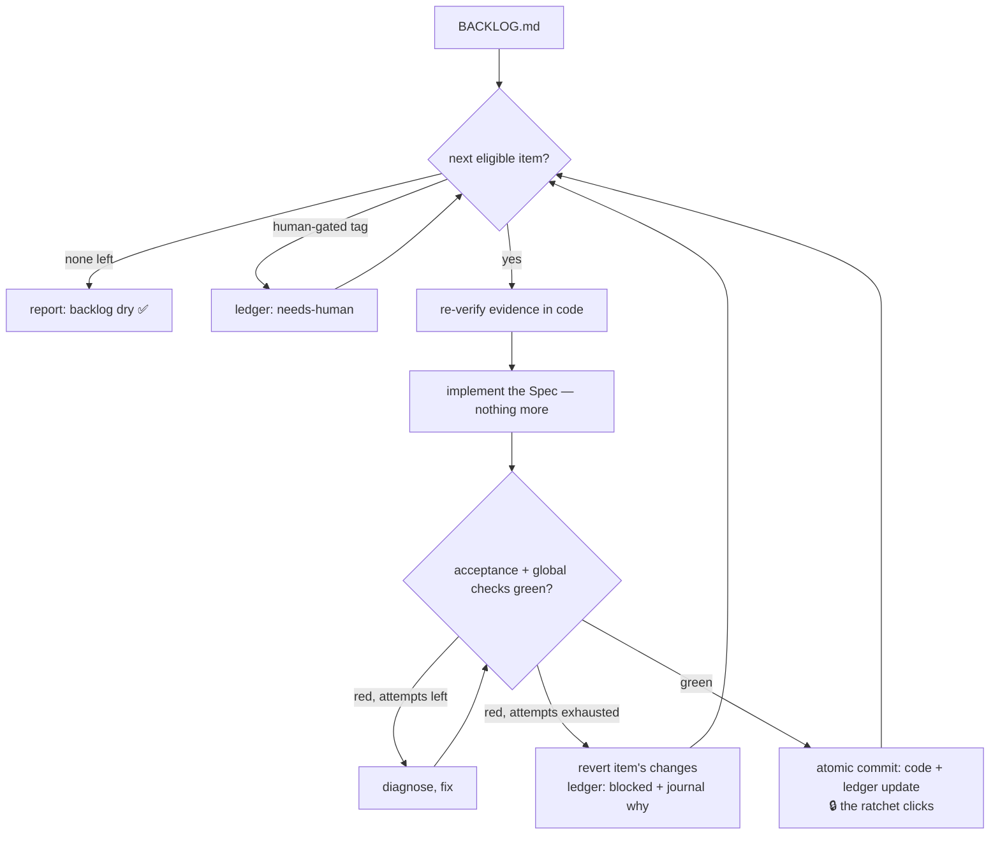
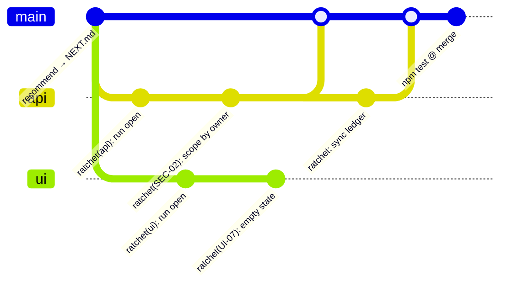

# ⚙️ Ratchet

**Verified, resumable engineering loops for Claude Code.**

A ratchet only turns forward. Every unit of work is gated by acceptance criteria and locked in as one atomic commit — the loop never slides back, never wanders off-spec, and never loses its place.

> Point it at a codebase → get a reviewable backlog → let the loop work through it, one verified commit at a time. Walk away. Come back to a ledger of what shipped, what's blocked, and what needs *you*.

---

## Why

Agentic coding is great at bursts and terrible at campaigns:

- **State lives in the context window.** Kill the session and the plan dies with it.
- **"Done" is vibes.** The agent says *fixed*; nothing proved it.
- **Scope creeps.** One fix becomes a refactor becomes a mess.
- **Autonomy is all-or-nothing.** Either you babysit every step, or you hand over the keys and pray.

Ratchet's answer is one structural move: **the loop's entire state lives in a markdown file** — `BACKLOG.md` — that is git-tracked, human-readable, and human-editable. The agent is stateless; the file is the state.

That one move buys everything else:

| Property | How |
|---|---|
| **Resumable** | Any new session reads the ledger + journal and continues where the last one died. Context resets are a non-event. |
| **Verified** | An item is *done* only when its acceptance criteria pass. The agent may not edit the criteria to make them pass — that's moving the goalposts, and it's banned. |
| **Atomic** | One item = one commit, containing the change **and** its ledger update. Every ratchet click is self-documenting and individually revertable. |
| **Safe** | Items tagged `[USER-DECISION]`, `[OPS]`, or `[RISKY]` are never executed — the loop parks them as `needs-human` and moves on. |
| **Reviewable** | The backlog is a file. It goes through PR review like any other code. No tracker, no API, no lock-in. |
| **Parallel** | [Format v2](#parallel-lanes-format-v2) splits the state into one file per lane, so several agents run the same backlog at once without a merge conflict. |

## The loop



Three nested loops:

1. **Inner** — per item: implement → verify → fix, with a bounded attempt count (no infinite thrashing).
2. **Outer** — item → item until the backlog is dry, a stop condition fires, or everything left needs a human.
3. **Meta** — re-run the audit to grow a fresh backlog. Schedulable (cron, CI, or Claude Code's own `/loop`) for standing "keep this repo healthy" automation.

## 60-second quickstart

Install as a plugin (one command, updates included):

```
/plugin marketplace add afrizzal/ratchet
/plugin install ratchet@ratchet
```

> Plugin installs namespace the commands: `/ratchet:ratchet-audit`, `/ratchet:ratchet-loop`, …
> Prefer bare names? Copy the skills instead (they then work as `/ratchet-audit` etc.):
>
> ```bash
> git clone https://github.com/afrizzal/ratchet
> cp -r ratchet/skills/* ~/.claude/skills/            # macOS/Linux
> Copy-Item -Recurse ratchet/skills/* "$env:USERPROFILE\.claude\skills\"   # Windows
> ```

Then, inside any project in Claude Code:

```
/ratchet-audit                        # deep multi-agent audit → ratchet/BACKLOG.md
# ...review & edit the backlog like code — delete items, adjust specs, add tags...
/ratchet-recommend                    # routed plan → ratchet/NEXT.md (what next + who does it)
/ratchet-loop --only SEC-01 --verify fresh   # paste the wave commands NEXT.md prescribes
/ratchet-ship                         # preflight → push → watch CI → smoke checklist
```

(Installed as a plugin? Prefix each command: `/ratchet:ratchet-audit`, `/ratchet:ratchet-loop`, …)

NEXT.md is *your* plan — the loop reads it and refuses to silently downgrade its verification
routing, but you issue the wave commands. Bare `/ratchet-loop` is the no-routing shortcut:
file-order execution of everything eligible. Run the loop on a work branch — the loop offers to
create one, and `/ratchet-ship` opens the PR.

### Running the plan with a cheaper model

This is the core motion: the expensive model audits and routes; a cheap model executes.

1. `/ratchet-audit` and `/ratchet-recommend` with your strongest model (Opus/Fable).
2. Switch: `/model sonnet` in the same session, or start a fresh one with `claude --model sonnet`.
3. Paste each wave's command from `ratchet/NEXT.md`. The loop makes the handoff safe by
   construction: it loads its own `executor-rules.md` (13 do-this-exactly rules for smaller
   models), honors NEXT.md's verify assignments, and hard-parks anything high-stakes that wasn't
   explicitly routed to it.

Don't want a full audit? Build a backlog from anything:

```
/ratchet-backlog create from TODO comments
/ratchet-backlog create from github issues
/ratchet-backlog add "rate-limit the /export endpoint"
```

## The format is the product

A ratchet backlog is plain markdown with a tiny contract ([full spec](docs/backlog-format.md)):

```markdown
### SEC-01 — Scope item lookups by tenant [P0]
- Tags: —
- Evidence: api/items/[id]/route.ts:16 — GET/PATCH/DELETE filter by group only, not space
- Spec: add spaceId (from the session helper) to all three where-clauses; use updateMany/deleteMany
- Acceptance:
  - [ ] `npx tsc --noEmit --incremental false` exits 0
  - [ ] request against another space's item id returns 404
  - [ ] existing save/delete flow in the UI still works

## Ledger
| ID | Status | Attempts | Commit | Note |
|---|---|---|---|---|
| SEC-01 | todo | 0 | — | — |

## Journal
- (the loop appends what it learned here — this is what makes resume cheap)
```

**Spec and state are separated by design.** Items are the immutable *what*; the Ledger + Journal are the mutable *where are we*. Humans edit items; the loop edits the ledger. Merge conflicts stay boring.

The format is agent-agnostic on purpose: these skills are the Claude Code implementation, but nothing stops a Cursor rule, a Codex prompt, or a bare script from executing the same file. Ports welcome — see [CONTRIBUTING](CONTRIBUTING.md).

### Parallel lanes (format v2)

One file, one writer — which means one executor at a time. **Format v2** ([spec](docs/backlog-format.md#5-format-v2--parallel-lanes-ratchetv2), [worked example](examples/v2/)) relocates the mutable state so several agents can work the same backlog concurrently:

```
ratchet/
  BACKLOG.md        # human-owned: Global checks + Lanes + Items. Executors never write it.
  lanes/core.md     # default lane — shared paths, dependencies, integration fixes
  lanes/api.md      # ledger + journal for Lane: api      ← one writer
  lanes/ui.md       # ledger + journal for Lane: ui       ← one writer
```

Each item declares a `Lane:`; each lane owns a disjoint slice of the tree and runs in its own worktree on `ratchet/<lane>`. Two executors, two lane files, two source scopes — nothing to merge-conflict over.

```
/ratchet-loop --lane api --only SEC-02 --verify fresh    # worktree A
/ratchet-loop --lane ui  --only UI-07  --verify inline   # worktree B, same time
```



(The branches are really named `ratchet/api` and `ratchet/ui`.) Each lane opens with a committed marker, lands each item as one atomic commit — source change **plus** its own ledger row — and closes with `ratchet: sync ledger`. A human merges, then re-runs the Global checks. The [worked example](examples/v2/) is this repo captured mid-wave, with both lanes open at once.

|  | v1 | v2 |
|---|---|---|
| **Executors at once** | one | one per lane |
| **Mutable state** | one `## Ledger` + `## Journal` in `BACKLOG.md` | one file per lane, single writer |
| **Coordination cost** | none | one merge per lane, plus a barrier for shared paths |
| **Ledger merge conflicts** | n/a (one writer) | none — no two writers share a file |
| **Source merge conflicts** | n/a | none *within* the format's rules; the barrier lane exists because scopes alone can't cover shared files |
| **Semantic conflicts** | n/a | still possible — lanes green apart can be red together, which is why the Global checks re-run at the merge |
| **When to use** | the default | the backlog is large *and* the work genuinely partitions |

What keeps it honest — every one of these exists because the naive version breaks:

- **Run markers.** A run opens its lane with a committed `run started` journal line and closes it with `run ended`. That is how a resuming agent tells *crash debris* (recover it) from *a live parallel run* (hands off), which a clean-tree check cannot do across worktrees.
- **The default lane is a barrier.** Anything whose diff escapes every named scope — a new dependency and its lockfile, generated files, a post-merge integration fix — lives in the `(rest)` lane, which runs alone, with every other lane closed and merged. Lane assignment follows the diff, not the theme.
- **Scope binds the diff, not just the Spec.** Before committing, the executor checks its diff's paths against its lane; a stray path parks the item rather than poisoning a merge.
- **Reads are global, writes are local.** A lane run reads every lane's ledger and journal — lessons don't respect scope boundaries — and writes exactly one file.
- **Humans get a write window.** Unparking, adding items, and grooming touch lane files only on the integration branch while that lane is closed. `BACKLOG.md` is frozen while any lane is open, so a Spec can't change under a `done` row that was earned against the old one.
- **Merging is a human step**, merge-commit or fast-forward only. Squash and rebase-merge rewrite shas and orphan every `Commit:` cell in the ledger. Lanes green apart can be red together, so the Global checks run again at the merge.

- **Stop conditions are per lane.** Two consecutive blocked items stop *that lane's* run; the sibling agent keeps going. A sick lane doesn't halt a healthy wave.

v1 is not deprecated and stays the default: one agent, one file, zero coordination. Reach for v2 when the backlog is big enough that parallelism beats simplicity **and** the work actually partitions — if every item touches `src/core/`, lanes buy you nothing. `/ratchet-backlog migrate` converts in one commit, preserving every ID, row, and journal line ([migration guide](CONTRIBUTING.md#migrating-a-backlog-from-v1-to-v2)); going back is just as cheap.

## The skills

| Skill | What it does |
|---|---|
| [`ratchet-audit`](skills/ratchet-audit/SKILL.md) | Fans out parallel subagents across your codebase (data layer, API/auth, business logic, tests/CI, frontend), verifies every finding down to file:line, and emits `ratchet/AUDIT.md` + a prioritized, acceptance-gated `ratchet/BACKLOG.md`. |
| [`ratchet-backlog`](skills/ratchet-backlog/SKILL.md) | Creates, validates, grooms, and migrates backlog files — from audits, TODO comments, GitHub issues, PRDs, or plain conversation. Enforces the invariant: **no acceptance criteria, no item.** Owns lane files in v2 (creation, rows, unparking). |
| [`ratchet-recommend`](skills/ratchet-recommend/SKILL.md) | The navigator. Read-only. Turns the backlog + ledger into a routed plan (`ratchet/NEXT.md`): what to do next, who does each item (autonomous cheap model / supervised / senior / human decision), in what order, with what verification. This is the layer that lets a cheaper model match a senior one — it inherits the routing instead of guessing it. |
| [`ratchet-loop`](skills/ratchet-loop/SKILL.md) ⭐ | The executor. Picks the next eligible item, implements exactly its spec, runs acceptance until green (bounded), commits atomically, updates the ledger, repeats. Stops cleanly; resumes for free. Ships with [`executor-rules.md`](skills/ratchet-loop/executor-rules.md) — 13 binding rules that make the loop safe for smaller models. |
| [`ratchet-ship`](skills/ratchet-ship/SKILL.md) | Release runbook: full preflight, diff & secret scan, push, watch CI to green, smoke checklist, rollback notes. |

## Field notes

Ratchet's workflow was extracted from a real engagement, not invented for this README. In its first field run on a production multi-tenant SaaS (40 tRPC routers, 76 database models, ~140k LOC), the audit surfaced **two HIGH-severity authorization flaws** that had survived months of feature work — one cross-tenant IDOR, one systemic permission-check gap — plus a prioritized backlog of 18 items with per-item acceptance criteria. The backlog was then executed item-by-item by a smaller model, every fix landing as its own verified commit, with human-gated items correctly parked for review.

The lesson that became Ratchet: **the handoff artifact matters more than the model.** A sharp backlog with checkable acceptance criteria lets a cheaper model execute safely what an expensive model discovered.

## Safety model

- The loop **requires a clean working tree** to start (its own state files excepted — those it recovers and commits), and reverts an item's changes completely if it can't get to green — a failed item never contaminates the next one.
- `[USER-DECISION]` / `[OPS]` / `[RISKY]` tags are hard gates. The loop reports; it does not improvise. Releasing a parked item is a documented human procedure ([Human transitions](docs/backlog-format.md)): journal the decision, clear the tag, status back to `todo`.
- **High-stakes gate, mechanical:** even *untagged* items touching auth, tenant boundaries, money/GL, migrations, secrets, deletion, or session handling only execute when a human (or the NEXT.md routing) explicitly listed them via `--only` **and** `--verify fresh` is on. No model self-assessment — the flags decide.
- Acceptance criteria are read-only to the loop. If a criterion turns out to be wrong, the item goes to `needs-human` — the goalposts don't move.
- Optional clean-room verification (`--verify fresh`): a separate subagent that never saw the implementation re-runs the acceptance criteria independently — the implementer doesn't grade its own homework.
- Crash-safe by design: `in-progress` marks and the ledger live in a git-tracked file; a resuming run recognizes its own debris, commits it as `ratchet: recover state`, resets orphaned items to `todo`, and continues.
- The loop won't quietly commit to a push-to-deploy default branch — it proposes a `ratchet/<scope>` work branch first; `/ratchet-ship` opens the PR.
- No force-pushes, no `--no-verify`, no amending history. Ever.
- Two consecutive blocked items stop the run — that pattern usually means something systemic, and a human should look.

### Unattended automation: the two-job rule

When nobody is at the keyboard — cron, CI, the shipped [`ratchet-audit` Action](.github/workflows/ratchet-audit.yml) — *"the agent was told not to"* is not a control. Two things that look like boundaries aren't:

- **Tool deny-lists are prefix matches, not a sandbox.** `Bash(git push:*)` never sees `git -c protocol.version=2 push origin HEAD:main`.
- **`actions/checkout` leaves a push credential on disk by default.** Any command in the job — including one the agent writes — can use it.

So don't ask the agent to abstain. Take the credential away, and split the run in two:

| Job | Runs the model? | Token | Can it write? |
|---|---|---|---|
| **audit** | yes | `contents: read`, checkout with `persist-credentials: false` | no — there is no push credential in its shell |
| **pr** | no | `contents: write` | yes, and no model can reach it |

Two more mechanical details do the rest:

- **The artifact is the pathspec.** Only the files the audit is allowed to produce cross the job boundary; nothing else is even uploaded.
- **Commit by pathspec** — `git commit -- ratchet/AUDIT.md ratchet/BACKLOG.md`. A bare `git commit -m` commits the whole index, so a file the agent staged would ride along inside a PR that claims to hold only artifacts. (`git add` is not on any deny-list worth trusting.)

Deny-lists still belong in the workflow — as a guardrail against an honest mistake, never as the boundary. The rule generalizes: **an unattended agent should hold no credential that can do the thing you are promising it won't do.**

## FAQ

**Why not just use GitHub issues?** Issues are great for humans coordinating. A backlog file is better for a loop: it travels with the branch, works offline, carries machine-checkable acceptance criteria, diffs in review, and costs zero API calls to read. Use `/ratchet-backlog create from github issues` to bridge.

**What stops an infinite loop?** Per-item attempt caps (default 3), the two-consecutive-blocks rule, an optional `--max-items` budget, and the fact that every state transition is written to the file — a stuck loop is visible and resumable, not mysterious.

**Can several agents work one backlog at once?** Yes, on [format v2](#parallel-lanes-format-v2): each agent takes a lane, writes only that lane's state file, and works a disjoint slice of the tree in its own worktree. Everything shared is serialized through the default lane's barrier. Start on v1 — migrate when the backlog is big enough that coordination pays for itself.

**Does it work unattended?** Yes — that's the point of file-based state. Pair `/ratchet-loop` with Claude Code's `/loop`, a cron job, or a CI workflow for standing automation. A ready-made GitHub Action for the meta-loop (scheduled `/ratchet-audit` → PR with a fresh backlog, never a direct push) ships at [`.github/workflows/ratchet-audit.yml`](.github/workflows/ratchet-audit.yml) — copy it into any repo. Read [the two-job rule](#unattended-automation-the-two-job-rule) before you wire up any agent that runs without you. Start attended until you trust your acceptance criteria.

**My project isn't Node/TypeScript.** Ratchet is stack-agnostic. The audit detects your toolchain and writes acceptance commands in it; the loop just runs whatever the criteria say.

## Prior art & positioning

- **Skill libraries** — [`anthropics/skills`](https://github.com/anthropics/skills), [`obra/superpowers`](https://github.com/obra/superpowers) — give agents *expertise*: personas, domain knowledge, tool recipes. Ratchet gives agents *a contract*. They compose: load whatever expertise you like; Ratchet governs how the work lands.
- **Loop machinery** — Anthropic's research on long-running agents, and `agent-harness` (in the repo above): a manifest → plan → loop-controller state machine in Python + JSON. Ratchet takes the same discipline — bounded retries, escalation, *never trust the agent's own claim of success* (that's where `--verify fresh` comes from) — and bets on the opposite implementation: the smallest possible contract, one markdown file, zero runtime scripts, reviewable in a PR.
- **Loop catalogs** — Forward-Future's `loop-library` documents *which* loops practitioners run. Ratchet is *how* one loop executes safely.

## Roadmap

- [x] Claude Code plugin packaging (one-command install)
- [x] GitHub Action: scheduled meta-loop (`audit → open PR with backlog`) — [`.github/workflows/ratchet-audit.yml`](.github/workflows/ratchet-audit.yml)
- [x] Backlog format v2: parallel lanes for multi-agent execution — [spec](docs/backlog-format.md#5-format-v2--parallel-lanes-ratchetv2), [walkthrough](examples/v2/)
- [ ] Port: Cursor rules
- [ ] Port: OpenAI Codex prompt pack

## License

[MIT](LICENSE). If Ratchet saved you a night of babysitting an agent, a ⭐ is the thank-you that helps others find it.
