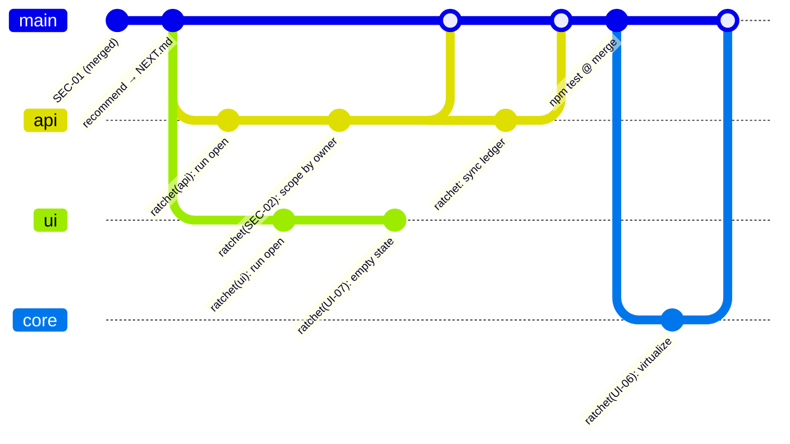

# Two agents, one backlog — a v2 walkthrough

These files are a real `ratchet:v2` backlog captured mid-flight, while **two agents work the same
project at the same time**. Read them in this order:

| File | What it is |
|---|---|
| [`BACKLOG.example.md`](BACKLOG.example.md) | Human-owned. Global checks, the lane table, the items. Executors never write it. |
| [`NEXT.example.md`](NEXT.example.md) | The routed plan that *produced* the parallel wave below. |
| [`lanes/api.example.md`](lanes/api.example.md) | Agent A's state file. **Open** — a run is in flight. |
| [`lanes/ui.example.md`](lanes/ui.example.md) | Agent B's state file. **Open** — the other run. |
| [`lanes/core.example.md`](lanes/core.example.md) | The default `(rest)` lane. Barrier work. Never run yet. |

## The shape of it

```
ratchet/
  BACKLOG.md        ← humans write.  Global checks · Lanes · Items (each item has a Lane:)
  lanes/
    core.md         ← (rest) — shared paths, dependencies, integration fixes. Barrier lane.
    api.md          ← ledger + journal for Lane: api     ┐ one writer each,
    ui.md           ← ledger + journal for Lane: ui      ┘ so never a merge conflict
  NEXT.md           ← the routed plan. Integration branch only.
```

In v1, all mutable state lives in one `## Ledger` and one `## Journal` inside `BACKLOG.md`. Two
agents means two writers on one table: adjacent-row conflicts, journal appends at the same file
offset, and a `pending` sha whose "next ledger write" nobody owns. v2 moves the state next to the
work: **one lane, one file, one writer.**

## What actually happens



(The branches are really named `ratchet/api`, `ratchet/ui`, `ratchet/core`.) Read left to right:
the two lane branches are cut from the same commit, each opens its lane with a committed
`run started` marker, each lands its item as one atomic commit — source change plus its own ledger
row — and each closes with `ratchet: sync ledger`. A human merges them and re-runs the Global
checks. Only *then* does the barrier lane run, because its item adds a dependency and therefore
touches `package.json` — ground no named lane owns.

**The snapshot in `lanes/*.example.md` is the moment both `run open` commits exist and neither
`sync ledger` does.** Both lanes are open. That is a healthy parallel wave, not a broken state.

## Who may write what

| | `BACKLOG.md` | own `lanes/<x>.md` | other `lanes/<y>.md` | `NEXT.md` | source in own scope | source elsewhere |
|---|---|---|---|---|---|---|
| **Executor** (lane run) | read | **write** | read | read | **write** | ✗ park the item |
| **Human / curator** | write¹ | write¹ | write¹ | write² | write | write |
| **recommend** | read | read | read | **write**² | — | — |

¹ On the integration branch, while that lane is **closed**. `BACKLOG.md` is frozen while any lane
is open — otherwise a Spec can change underneath a `done` row that was earned against the old one,
and the merge would be clean and silent.
² Integration branch only. `NEXT.md` is regenerated wholesale, so a copy on a lane branch is a
guaranteed conflict.

## The four things that make it safe

Disjoint path globs alone do **not** make parallel agents safe. Each of these exists because the
naive version breaks:

1. **Run markers.** A run opens its lane with a committed `- <date> run started (lane api, branch ratchet/api)`
   and closes it with `run ended`. A lane is *open* when the last marker is `run started`. This is
   the only way a resuming agent can tell **crash debris** (recover it) from a **live parallel run**
   (hands off) — a clean-tree check can't, because the other run's dirt is in another worktree.
   A recovering run continues under the existing marker; it never appends a second `run started`.
2. **A barrier lane.** An item whose Spec adds a dependency has in-scope Evidence and an
   out-of-scope diff (`package.json`, the lockfile). Two lanes doing that in one wave collide.
   So everything shared lives in the first-declared `(rest)` lane, which runs **alone** — all other
   lanes closed and merged. Before committing, an executor checks its diff's paths against its own
   lane and parks anything that escapes. *Lane assignment follows the diff, not the topic.*
3. **A human write window.** Unparking, adding items, and grooming all write lane files. Doing that
   while a lane is live re-creates the exact ledger conflict v2 removed — so those edits happen on
   the integration branch, with the lane closed.
4. **Human-owned merges, merge-commit or fast-forward only.** Squash and rebase-merge rewrite shas
   and orphan every `Commit:` cell in the merged ledger. And lanes green in isolation can be red
   together, so the Global checks run again at the merge point.

## What v2 does not change

Everything that makes a ratchet a ratchet:

- **No acceptance criteria, no item** — identical in every lane. v2 changes where state lives,
  never what *done* means.
- One item = one atomic commit = the source change **plus** its lane file's ledger row.
- Items are read-only to executors; the goalposts never move.
- The high-stakes gate: an ungated item touching auth, money, migrations, secrets, or deletion runs
  only with `--verify fresh` **and** an explicit `--only`. `--lane` is a state-file selector and
  never satisfies that requirement.
- Attempts cap at 3; two consecutive blocked items stop the run — **that lane's** run, not its
  siblings'.
- Parking is per-item, stopping is per-run, and unparking is human-only.

## Try it

```
/ratchet-backlog migrate     # v1 → v2, one commit, IDs and history preserved
/ratchet-recommend           # routed plan, with concurrent waves marked ∥
```

Then paste the wave commands into two terminals. Full contract:
[`docs/backlog-format.md` §5](../../docs/backlog-format.md#5-format-v2--parallel-lanes-ratchetv2).
Migration guide: [CONTRIBUTING.md](../../CONTRIBUTING.md#migrating-a-backlog-from-v1-to-v2).
